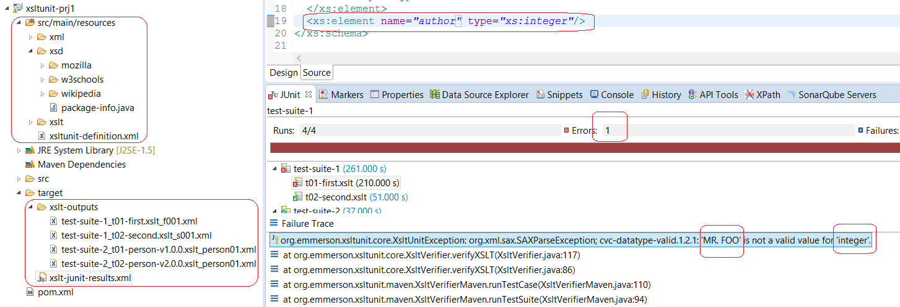

# XSLTUnit (XSLT Unit testing)

This project enable validation of the outputs of XSLT transformations against XSD files and create a JUnit report file, in other words this project allow you validate the results of your XSLTs are full-compliant with their target schemas, or even detect possible problems in production environments when the schemas definition changes.

This project support JSON files a source files converting all of them to XML files.

The below image show the output in Eclipse by just click on *xslt-junit-results.xml* file.


### Structure of a XSLTUnit project


By default all the files (XSLT, XSD and XMLs) will be under *src/main/resources* folder and can be organized in folders as you need.

### Analizing results



To analize just run "mvn compile" in your project, after that you can analize the reports and even the outputs of the transformations (have a look in the *target/xslt-outputs*).


## Configuration

The file *src/main/resources/xsltunit-definition.xml* store the association between XSLT, XSD and XML files and the root element is *xsltunit* and it can contains severals suites.


Each *suite* have a "key"(showed in JUnit report) a "description" and can store multiple tests.


Each *test* have a "key"(showed in JUnit report) a "description" and other properties like:

* xslt - path to a concrete XSLT file (file under test)
* xsd - path to a concrete XSD or set of XSDs (support Ant file selector expression) to be used to validate the output of XSLT file.
* xml - XML sources to be used by the XSLT file (support Ant file selector expression)


Example:
```xml
<?xml version="1.0" encoding="UTF-8"?>
<xsltunit version="1.0" 
	xmlns:xsi="http://www.w3.org/2001/XMLSchema-instance"
	xsi:noNamespaceSchemaLocation="https://raw.githubusercontent.com/Emmerson-Miranda/XSLTUnit/master/xsltunit-definition-1.0.0.xsd">
	<suite key="test-suite-1" description="Fist suite">
		<test key="t01-first.xslt"  description="Test one"
		    xslt="xslt/mozilla/first.xslt" 
		    xsd="xsd/mozilla/f*.xsd" 
		    xml-sources="xml/**/f*.xml" 
		/>
		<test key="t02-second.xslt" description="Test two"
		    xslt="xslt/mozilla/second.xslt" 
		    xsd="xsd/mozilla/s*.xsd" 
		    xml-sources="xml/**/s*.xml" 
		/>
	</suite>

	<suite key="test-suite-2" description="second suite">
		<test key="t01-person-v1.0.0.xslt" description="Test mozilla" 
		    xslt="xslt/wikipedia/person-v1.0.0.xslt" 
		    xsd="xsd/wikipedia/person-v1*.xsd" 
		    xml-sources="xml/wikipedia/*.xml" 
		/>
	</suite>
</xsltunit>
```

# How to work with XSLTUnit


1. Create the project with XSLTUnit maven archetype
2. Organize your XSD and XML files in folders under *src/main/resources* 
3. Create your XSLT files
4. Configure the file *xsltunit-definition.xml* to make the associations among the files.
5. From command line console, go to your root folder project and run "mvn compile"
6. If the results of run your XSLT are OK you will get a "BUILD SUCCESS", if not you will get an error.
7. Analize the results inspecting the *xslt-junit-results.xml* file.


# Where use XSLTUnit

For example in SOA projects who use lots of XSLTs and needs validate the outputs against WSDLs or XSDs without need the servers started.


# Download and Install

```bash
git clone https://github.com/Emmerson-Miranda/XSLTUnit.git
cd XSLTUnit/xsltunit
mvn install
```

## Requirements

* Java 1.8
* Maven 3


# More info
Please review wiki pages
